# TrainPal Backend

## Introduction

### About TrainPal
TrainPal is a mobile application designed to connect fitness enthusiasts, enabling trainers and trainees to collaborate seamlessly in their fitness journeys. Whether you're a professional trainer offering personalized workout sessions or a trainee seeking to achieve your fitness goals, TrainPal provides a platform to discover, schedule, and manage training sessions with ease. Key features include user registration, course creation and booking, online payments via MoMo, and real-time messaging, all accessible through an intuitive mobile interface.


<!--  -->

### TrainPal Backend
The backend of TrainPal is built using Django, a robust Python web framework, structured in a microservices-like architecture within a single Django project for modularity and scalability. It is divided into four main services: `user_service` for authentication and profile management, `course_service` for course and session management, `payment_service` for handling transactions, and `message_service` for real-time chat. The backend leverages multiple databases—PostgreSQL for user, course, and payment data; MongoDB for messaging; and Redis for WebSocket communication—to ensure efficient data handling and isolation.

## Installation Guide
This section guides you through setting up the TrainPal backend environment using Conda and running the server.

### Prerequisites
- **Python**: Version 3.8 or higher
- **Conda**: Install Miniconda or Anaconda from [here](https://www.anaconda.com/products/distribution)
- **PostgreSQL**: Version 12 or higher
- **MongoDB**: Version 4.4 or higher
- **Redis**: Version 6 or higher
- **Git**: For cloning the repository

### Setup Instructions
1. **Clone the Repository**:
   ```bash
   git clone https://github.com/your-repo/trainpal_dj.git
   cd trainpal_dj
   ```

2. **Create a Conda Environment**:
   ```bash
   conda create -n trainpal_env python=3.8
   conda activate trainpal_env
   ```

3. **Install Dependencies**:
   Install the required Python packages listed in `requirements.txt`:
   ```bash
   pip install -r requirements.txt
   ```

4. **Configure Databases**:
   - **PostgreSQL**:
     - Install PostgreSQL and create databases for `user_service`, `course_service`, and `payment_service`:
       ```bash
       psql -U postgres
       CREATE DATABASE user_service_db;
       CREATE DATABASE course_service_db;
       CREATE DATABASE payment_service_db;
       ```
     - Update `trainpal_dj/settings.py` with your PostgreSQL credentials (e.g., `USER`, `PASSWORD`).
   - **MongoDB**:
     - Install MongoDB and start the MongoDB server:
       ```bash
       mongod
       ```
     - Ensure `message_service_db` is accessible (default: `localhost:27017`).
   - **Redis**:
     - Install Redis and start the Redis server:
       ```bash
       redis-server
       ```
     - Ensure Redis is running on `localhost:6379`.

5. **Apply Migrations**:
   Run migrations for each service with the appropriate database:
   ```bash
   python manage.py makemigrations user_service
   python manage.py migrate user_service --database=user_service
   python manage.py makemigrations course_service
   python manage.py migrate course_service --database=course_service
   python manage.py makemigrations payment_service
   python manage.py migrate payment_service --database=payment_service
   python manage.py makemigrations message_service
   python manage.py migrate message_service --database=message_service
   ```

6. **Run the Server**:
   Start the Django development server:
   ```bash
   python manage.py runserver
   ```
   The server will be available at `http://localhost:8000`. WebSocket endpoints are accessible at `ws://localhost:8000/ws/chat/<user_id>/`.

7. **Test the Application**:
   - Use tools like Postman or curl to test REST APIs (e.g., `http://localhost:8000/api/user/register/`).
   - Use a WebSocket client (e.g., `wscat`) to test messaging: `wscat -c ws://localhost:8000/ws/chat/<user_id>/ -H "Authorization: Bearer <jwt_token>"`.

## Application Functionality
TrainPal provides a comprehensive set of features for fitness trainers and trainees to interact seamlessly. Below is an overview of the core functionalities, accompanied by illustrative screenshots (placeholders).

### Register & Login
Users can register as either a **trainer** or a **trainee** and log in to access the platform. The authentication system uses JSON Web Tokens (JWT) for secure access.

- **Endpoints**:
  - `POST /api/user/register/`: Register a new user.
  - `POST /api/user/login/`: Log in and receive JWT tokens.
  - `POST /api/user/token-refresh/`: Refresh access tokens.
  - `POST /api/user/logout/`: Log out.

- **Demo**:
<div style="display: flex; flex-wrap: wrap; gap: 10px;">
  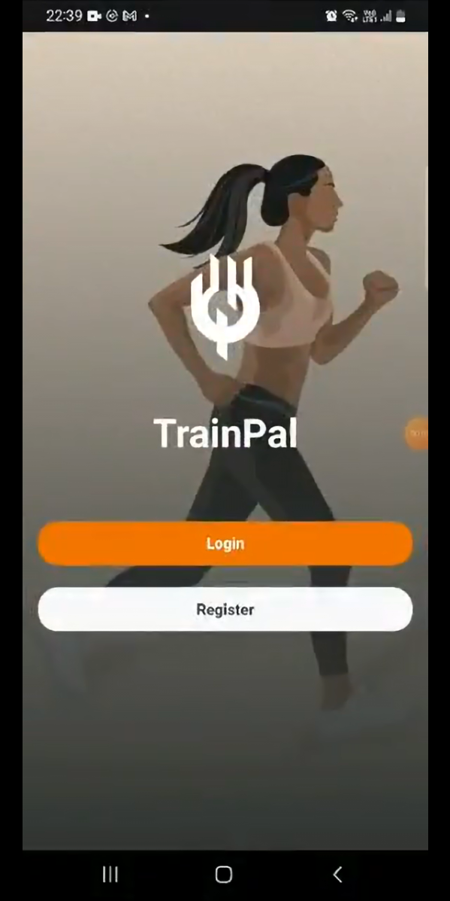
  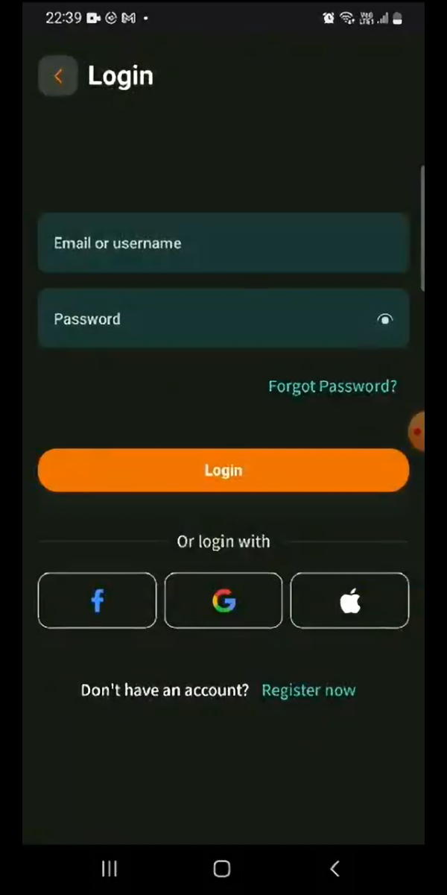
  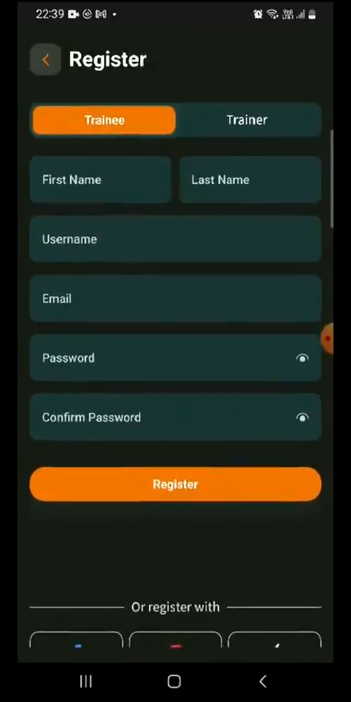
  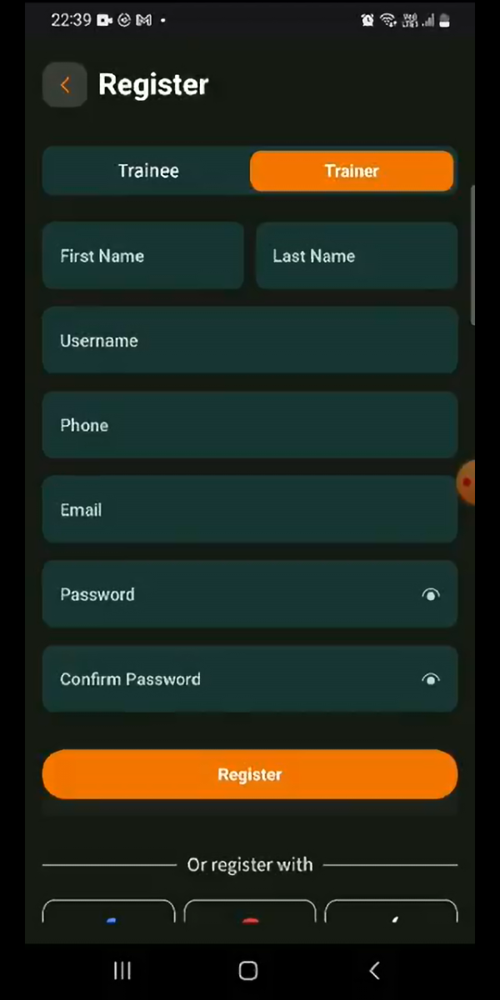
  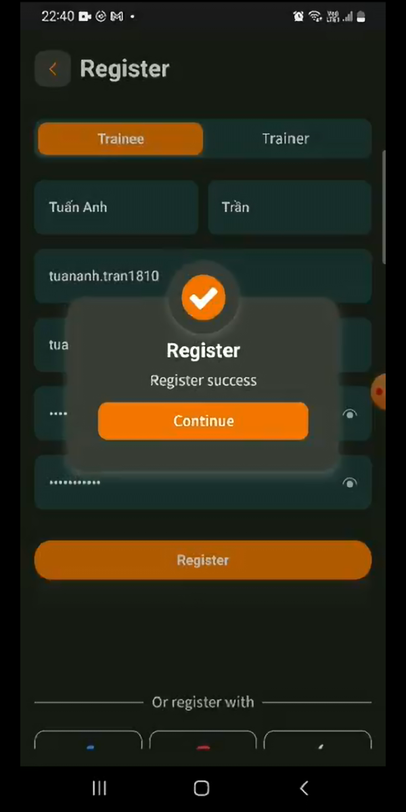
  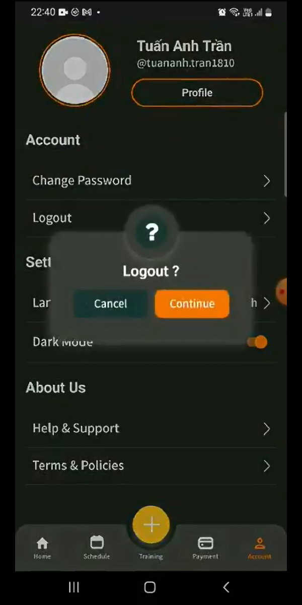
</div>

### Manage User Profile
Users can view and update their profiles, including personal details such as name, email, phone, avatar, and bio. Trainers can specify their expertise, while trainees can manage their preferences.

- **Endpoints**:
  - `GET /api/user/profile/<pk>/`: Retrieve user profile.
  - `POST /api/user/update-profile/`: Update user profile.

- **Demo**:
<div style="display: flex; flex-wrap: wrap; gap: 10px;">
  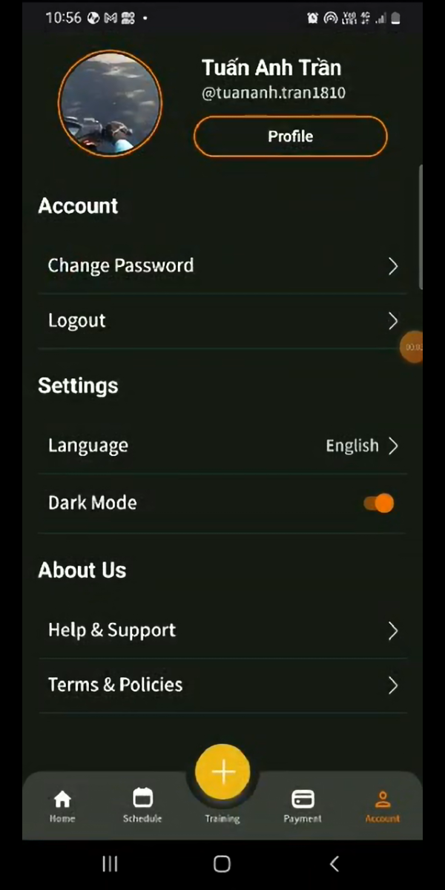
  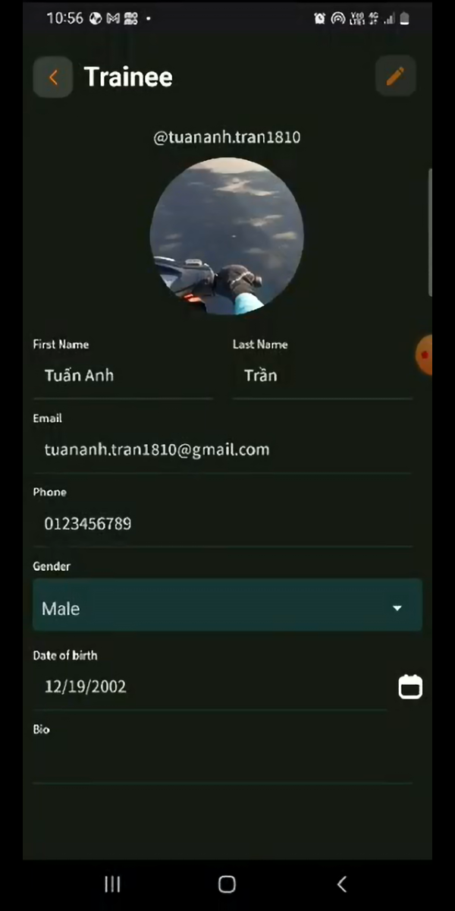
  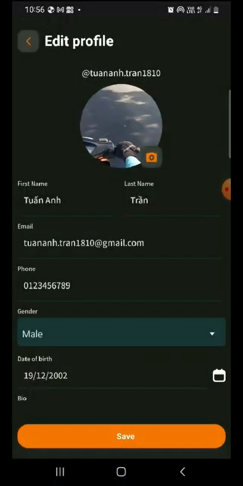
  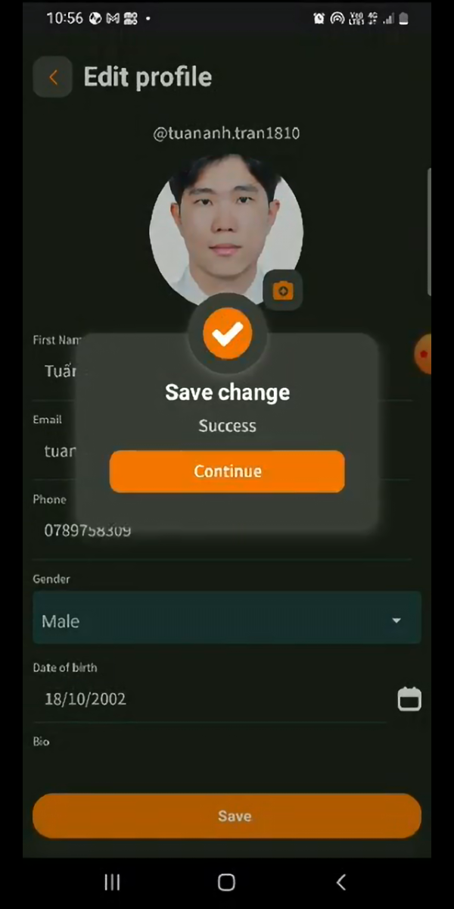
</div>

### For Trainers
Trainers have access to tools to manage their fitness offerings:

#### Create and Manage Courses
Trainers can create courses (e.g., yoga, boxing) with details like title, description, price, and location.
- **Endpoints**: 
  - `POST /api/course/create-course/`: Create a new course.
  - `POST /api/course/update-course/`: Update an existing course.
  - `GET /api/course/delete-course/<pk>/`: Delete a course.

- **Demo**:
<div style="display: flex; flex-wrap: wrap; gap: 10px;">
  
  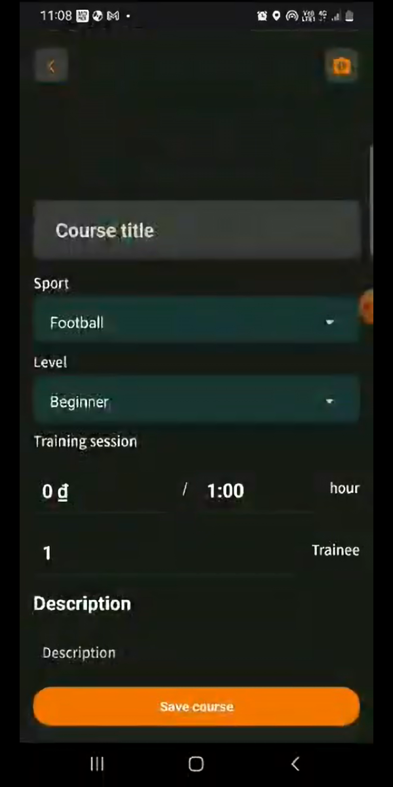
  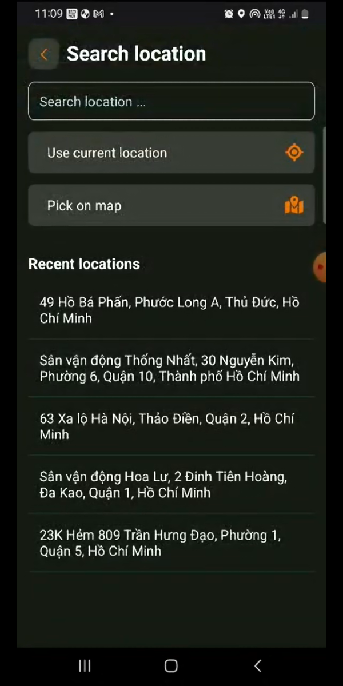
  
</div>

- **Schedule Training Sessions**: Trainers can schedule training sessions for their courses.
  - `POST /api/course/add-training/`: Add a training session.
  - `GET /api/course/delete-training/<pk>/`: Delete a training session.
- **View Bookings and Payments**: Trainers can view bookings and payments received for their sessions.
  - `GET /api/course/booking/`: List bookings for the trainer's courses.
  - `GET /api/payment/payments/`: List payments received.

*Placeholder for Screenshot: [Insert image of trainer dashboard showing course creation or session scheduling here]*

### For Trainees
Trainees can browse, book, pay for, and communicate about training sessions:
- **Browse and Book Courses**: Trainees can search for courses using filters such as sport type (e.g., yoga, boxing), trainer, location, price, or level (beginner, intermediate, advanced). They can also find courses near their location using a map-based search, leveraging geolocation to display courses within a specified radius.
  - `GET /api/course/courses/`: List available courses with optional query parameters (e.g., `?sport=YG` for yoga, `?latlng=10.7769,106.7009&radius=5000` for courses within 5km).
  - `POST /api/course/add-booking/`: Book a training session.
- **Make Payments**: Trainees can pay for sessions via MoMo or offline methods.
  - `POST /api/payment/create-payment/`: Create a payment.
  - `GET /api/payment/momo-payment/`: Initiate a MoMo payment.
- **Messaging**: Trainees can chat with trainers in real-time to coordinate sessions.
  - `GET /api/message/chatroom/`: Get or create a chat room.
  - `GET /api/message/messages/<room_id>/`: Retrieve messages.
  - WebSocket: `ws://localhost:8000/ws/chat/<user_id>/` for real-time messaging.

*Placeholder for Screenshot: [Insert image of trainee dashboard showing course browsing with filters or map-based search here]*

## Links
- **Frontend Repository**: Explore the TrainPal mobile frontend code at [https://github.com/your-repo/trainpal_frontend](https://github.com/your-repo/trainpal_frontend).
- **Video Demo**: Watch a demo of the TrainPal application in action at [https://www.youtube.com/your-video-demo](https://www.youtube.com/your-video-demo).

## Contributing
Contributions are welcome! Please fork the repository, create a new branch, and submit a pull request with your changes. Ensure that your code adheres to the project's coding standards and includes tests.

## License
This project is licensed under the MIT License. See the `LICENSE` file for details.

## Contact
For questions or support, contact the development team at [your-email@example.com].